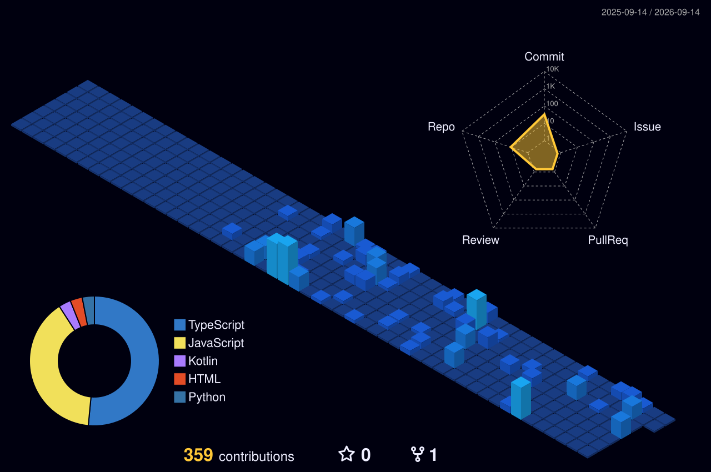

<h1 align="center">Ikechukwu &nbsp;·&nbsp; <code>@hykelauncher</code></h1>

  

  
  
  
  
  

---

### About

Electrical engineer by training, product builder by habit. I split my time between
power systems on the bench and shipping web / mobile products — usually solving a
problem I ran into myself, usually for a Nigerian or UK market that bigger players ignore.

- 🎓 **B.Eng. Electrical Engineering** — Nnamdi Azikiwe University
- ⚡ **Solar, inverter & electrical technician** — installs, repairs, load design
- 💻 **Full-stack** — Next.js, TypeScript, PHP/Laravel, Firebase, Supabase, MySQL
- 📱 **Android** — Kotlin, CameraX, Android SDK
- ⛓️ **On-chain** — Solidity, testnet tooling, cross-chain experiments
- 📫 `hykelauncher@gmail.com` · `ikechukwudamilola6@gmail.com`

---

### What I'm building

| Project | What it is | Stack | Live |
|---|---|---|---|
| **[Hyke Web Creator](https://github.com/hykelauncher/hykewebcreator)** | Wix-style website builder & hosting — templates, drag-and-drop editor, publish to a subdomain | Next.js 16, Turbopack | [↗](https://hykewebcreator.vercel.app) |
| **[LoveLink UK](https://github.com/hykelauncher/LoveLinkUk)** | Dating app for UK singles 22–40 — availability-first matching, AI icebreakers | Next.js 15, Supabase, Stripe | [↗](https://lovelink.uk) |
| **[VisitPay](https://github.com/hykelauncher/visitpay)** | Earning platform with streak journeys, live payout proof, admin command center | Next.js, MySQL | [↗](https://visitpay.vercel.app) |
| **[CryptoForge](https://github.com/hykelauncher/cryptoforge)** | Encryption, hashing & encoding toolkit — fully client-side, nothing leaves the browser | TypeScript, WebCrypto | [↗](https://cryptoforge-lac.vercel.app) |
| **[Learnix](https://github.com/hykelauncher/Learnix)** | Offline-capable LMS for WAEC / JAMB / BECE students, teachers and parents | TypeScript | — |
| **[Loop](https://github.com/hykelauncher/loop)** | Android background video recorder with dashcam-style rolling buffer | Kotlin, CameraX | — |
| **[SureRent](https://github.com/hykelauncher/surerent)** | Proptech connecting tenants directly to verified landlords — no predatory agent fees | Laravel, Blade | — |
| **[MailRent](https://github.com/hykelauncher/mailrent)** | Self-hosted rental mail platform, paid by card or crypto | TypeScript, Stalwart | — |

---

### Tech stack

<table align="center">
  <tr>
    <td align="right"><b>Web</b></td>
    <td></td>
  </tr>
  <tr>
    <td align="right"><b>Backend</b></td>
    <td></td>
  </tr>
  <tr>
    <td align="right"><b>Mobile</b></td>
    <td></td>
  </tr>
  <tr>
    <td align="right"><b>Chain</b></td>
    <td></td>
  </tr>
  <tr>
    <td align="right"><b>Tools</b></td>
    <td></td>
  </tr>
</table>

---

### Stats

<!-- Stats + top languages are served from my own Vercel deployment of
     anuraghazra/github-readme-stats, so no third-party outage can break them. -->

  
  

  

  

<!-- Regenerated nightly by .github/workflows/3d-contrib.yml -->
<picture>
  <source media="(prefers-color-scheme: dark)" srcset="./profile-3d-contrib/profile-night-view.svg" />
  <source media="(prefers-color-scheme: light)" srcset="./profile-3d-contrib/profile-season-animate.svg" />
  
</picture>

<picture>
  <source media="(prefers-color-scheme: dark)" srcset="https://raw.githubusercontent.com/hykelauncher/hykelauncher/output/github-contribution-grid-snake-dark.svg" />
  <source media="(prefers-color-scheme: light)" srcset="https://raw.githubusercontent.com/hykelauncher/hykelauncher/output/github-contribution-grid-snake.svg" />
  
</picture>

---

  <i>🔋 I can fix your inverter and write your mobile app the same day.</i> 
  Open to freelance and collaboration — reach me on <a href="https://www.linkedin.com/in/hykelauncher">LinkedIn</a> or by email.

